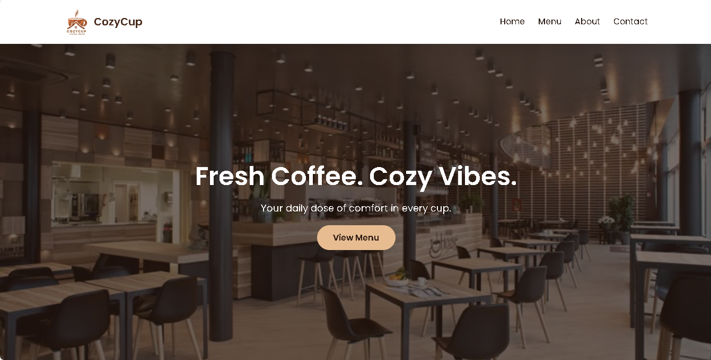
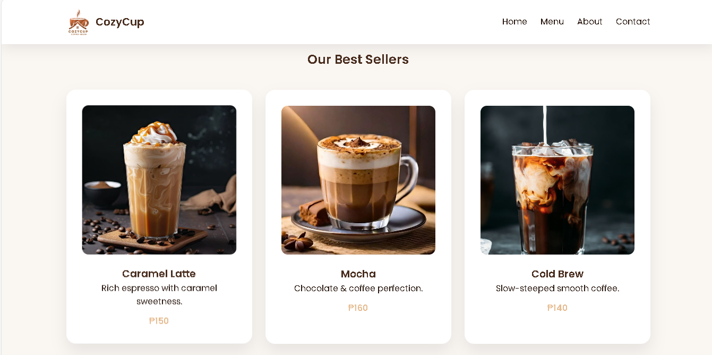

# Cozy Cup Cafe

## Project Description

Cozy Cup Cafe is a simple and modern café website created using HTML and CSS.  
It is designed to showcase best-selling coffee drinks, introduce the brand, and provide contact information in a clean and cozy layout.

---

## Features

* Modern and cozy café design  
* Hero section with background image  
* Best seller menu with images and prices  
* Responsive grid layout  
* Hover effects on menu cards  
* About and Contact sections  

---

## Screen Captures

### Home Page
  
The hero section with background image and call-to-action button.

### Menu Section
  
Displays the best-selling coffee drinks with images and prices.

### About Section
  
Shows the story behind Cozy Cup Cafe.

### Contact Section
  
Contains the café’s contact details.

---

## About the Authors

**Name:** Princess Heaven Rica
**Email:** ricaheaven@gmail.com  

**Name:** Romel Garcia

**Email:** 202180288@psu.palawan.edu.ph 

---

## Connect with Us

